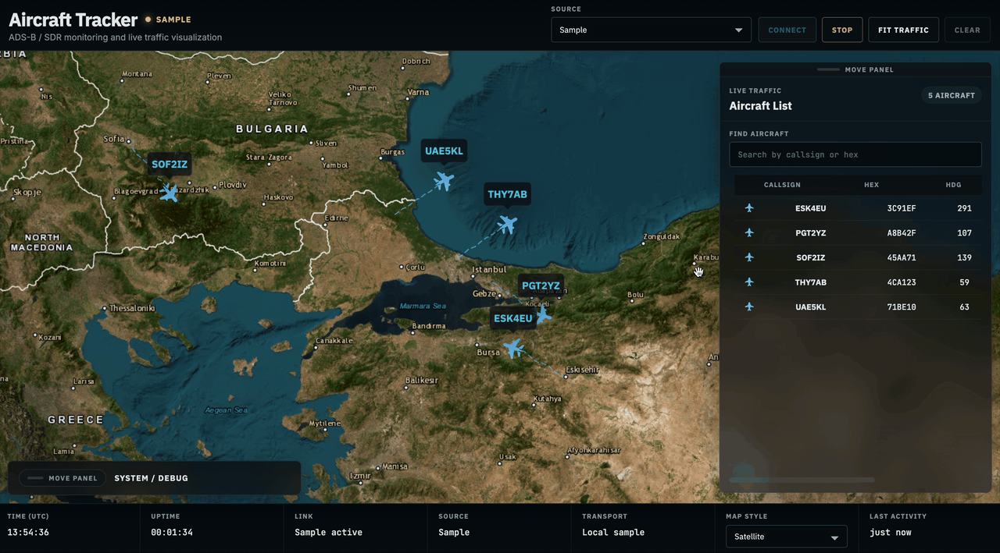

# ADS-B Aircraft Tracker

Real-time aircraft tracking built around ADS-B decoder output, a Python backend, and a Leaflet-based 2D operations screen.



## Overview

This project focuses on the full data path, not just the map:

- ingest decoder output such as `readsb` or `dump1090`
- normalize aircraft telemetry into a stable internal model
- maintain active aircraft state with bounded trails and stale eviction
- publish snapshot and delta updates over WebSocket
- visualize traffic in a cleaner 2D operations UI

## What Works Today

- built-in sample mode for local demo and UI validation
- 2D tracker served directly from the backend at `/`
- selectable source modes in the UI:
  - `Sample`
  - `RTL-SDR / readsb`
  - `RTL-SDR / dump1090`
- snapshot and delta streaming over WebSocket
- file-based decoder polling for `aircraft.json` style sources
- selected-flight panel, live traffic list, draggable panels, and aircraft trails

## What Is Not Finished Yet

- field validation against a real live SDR capture setup
- richer operational filters and SDR health visibility
- replay, recording workflows, and packaging

## Quick Start

### Requirements

- Python `3.11+`
- a modern desktop browser
- optional: Node.js, only if you want to run frontend tests

### Recommended Local Setup

Homebrew-managed Python often blocks global `pip install`, so a virtual environment is the safest path.

```bash
cd /path/to/adsb-aircraft-tracker
python3 -m venv .venv
source .venv/bin/activate
python -m pip install -r backend/requirements.txt
```

### Run The Default Tracker

```bash
cd backend
python -m app.main
```

Then open:

```text
http://127.0.0.1:8000/
```

In the UI:

1. leave `Source` on `Sample`
2. click `Connect`

That starts the demo flow with mock aircraft and live trails.

## Run Modes

### 1. Built-in Sample Mode

This is the easiest way to validate the full UI locally.

```bash
cd backend
python -m app.main
```

Open `http://127.0.0.1:8000/`, choose `Sample`, then click `Connect`.

### 2. `readsb` Snapshot File Mode

If you already have a decoder snapshot file, point the backend at it:

```bash
cd backend
ADSB_SOURCE_MODE=readsb_file \
ADSB_READSB_SNAPSHOT_PATH=/absolute/path/to/readsb/aircraft.json \
python -m app.main
```

Then open `http://127.0.0.1:8000/`, choose `RTL-SDR / readsb`, and click `Connect`.

### 3. `dump1090` Snapshot File Mode

```bash
cd backend
ADSB_SOURCE_MODE=dump1090_file \
ADSB_DUMP1090_SNAPSHOT_PATH=/absolute/path/to/dump1090/aircraft.json \
python -m app.main
```

Then open `http://127.0.0.1:8000/`, choose `RTL-SDR / dump1090`, and click `Connect`.

### 4. Standalone Frontend

You can also serve the client without the backend:

```bash
cd frontend/client-2d
python3 -m http.server 8080
```

Then open:

```text
http://127.0.0.1:8080/
```

Notes:

- `Sample` still works in standalone mode
- `readsb` and `dump1090` require a backend running on `127.0.0.1:8000`

## Optional Runtime Configuration

- `ADSB_SOURCE_MODE`
  Initial backend source. Supported values: `sample`, `readsb_file`, `dump1090_file`, `none`

- `ADSB_READSB_SNAPSHOT_PATH`
  Path to a `readsb` style `aircraft.json`

- `ADSB_DUMP1090_SNAPSHOT_PATH`
  Path to a `dump1090` style `aircraft.json`

- `ADSB_STALE_AFTER_SECONDS`
  Stale track eviction timeout. Default: `12`

- `ADSB_POLL_INTERVAL_SECONDS`
  Decoder file polling interval in seconds. Default: `1.0`

- `ADSB_SAMPLE_INTERVAL_SECONDS`
  Sample feed tick interval in seconds. Default: `1.2`

- `ADSB_HOST`
  Backend bind host. Default: `127.0.0.1`

- `ADSB_PORT`
  Backend bind port. Default: `8000`

- `ADSB_RELOAD`
  Set to `1` for uvicorn reload mode during development

## Tests

Backend:

```bash
python3 -m unittest discover -s backend/tests -v
```

Frontend:

```bash
node --test frontend/client-2d/tests/*.test.mjs
node --check frontend/client-2d/app.js
```

## Repository Layout

```text
backend/
  app/
    api/
    ingestion/
    models/
    runtime/
    services/
    state/
    streaming/
  tests/
docs/
samples/
scripts/
frontend/
  client-2d/
```

## Extra Debug Tool

You can inspect the ingestion and state pipeline directly with:

```bash
python3 scripts/debug_state_view.py --snapshot samples/fixtures/readsb/basic_snapshot.json
```

## Roadmap

- validate against real SDR field data
- add better filtering and follow controls
- add replay and recording workflows
- improve packaging and deployment ergonomics
